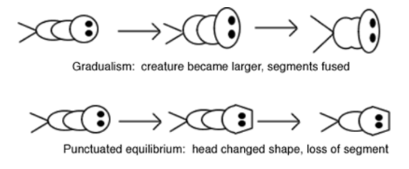
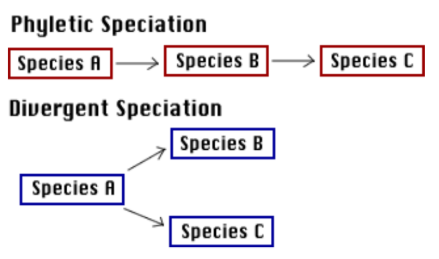

# Fossil Record Lab

 
 
 

## Terms

 

>Morphologies: appearances of fossils  

>Gradualism: organisms evolve through a process of **slow** and constant change

>Puncuated equilibrium: species evolve very **rapidly** and they stay the same for a large period of time

>Speciation: the creation of new species

>Phyletic speciation: abrupt mutations in a few regulatory genes occur after a species has existed for a long period of time

>Divergent speciation: gradual accumulation of small genetic changes results in a subpopulation of a species that eventually accumulates so mnay changes that the supopulations become different species.

>Phylogenetic tree: An evolutionary tree that can be used to place fossils in sequences that often show patterns of changes that have occurred over time

 
 
 

Phyletic speciation relates to punctuated equilibrium  
Divergent speciation relates to gradualism

 
 
 

### Gradualism and Punctuated Equilibrium Chart
 

 
 
 

### Speciation Types Chart
 

